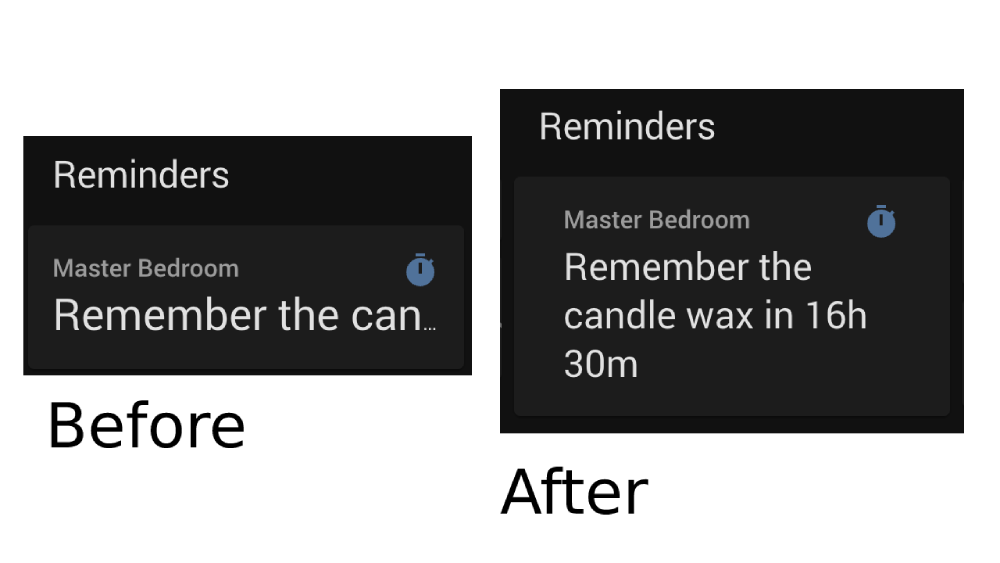

# Multiline Entity Card
 A custom entity card modelled on the original Entity card for [Home Assistant](https://www.home-assistant.io/) that allows text to span multiple lines.

 

 [![GitHub Release][releases-shield]][releases]
 [![License][license-shield]](LICENSE.md)
 ![Project Maintenance][maintenance-shield]
 [](https://github.com/custom-components/hacs)

 ## Installation through [HACS](https://github.com/custom-components/hacs)

 Use [HACS](https://github.com/custom-components/hacs) to install the **Multiline Entity Card** plugin.

 ## Configuration

 ```yaml
 type: 'custom:multiline-entity-card'
 ```

 ### Example:
 ```yaml
 type: 'custom:multiline-entity-card'
 name: "Master Bedroom"
 entity: sensor.master_bedroom_reminders
 attribute: next_reminder
 show_icon: true
 image: /local/image/file.png
 show_name: true
 ```

 [commits-shield]: https://img.shields.io/github/commit-activity/y/jampez77/multiline-entity-card.svg?style=for-the-badge
 [commits]: https://github.com/jampez77/multiline-entity-card/commits/master
 [license-shield]: https://img.shields.io/github/license/jampez77/multiline-entity-card.svg?style=for-the-badge
 [maintenance-shield]: https://img.shields.io/badge/Maintainer-Jamie%20Nandhra--Pezone-blue
 [releases-shield]: https://img.shields.io/github/release/jampez77/multiline-entity-card.svg?style=for-the-badge
 [releases]: https://github.com/jampez77/multiline-entity-card/releases
